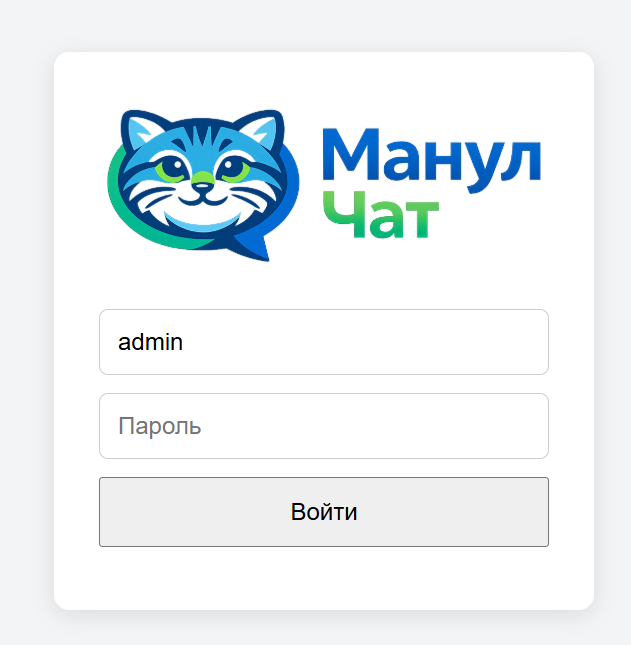
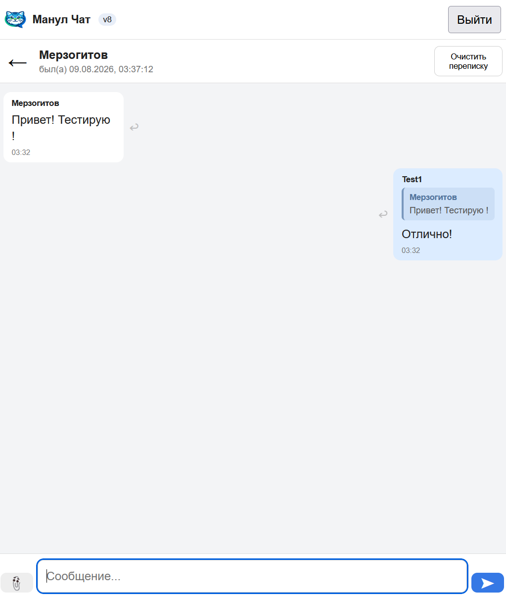
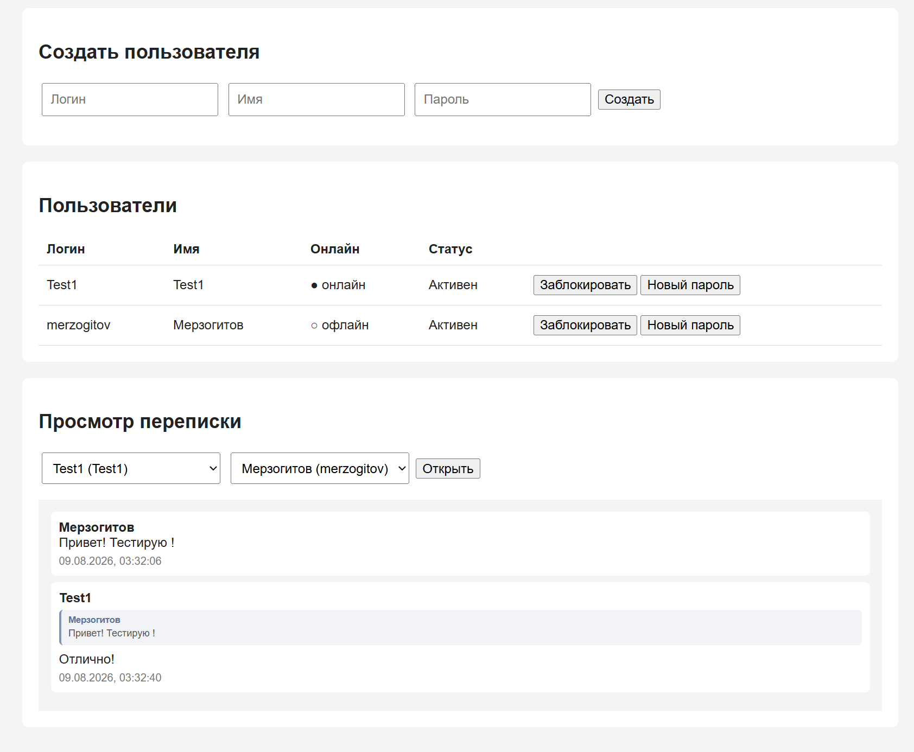
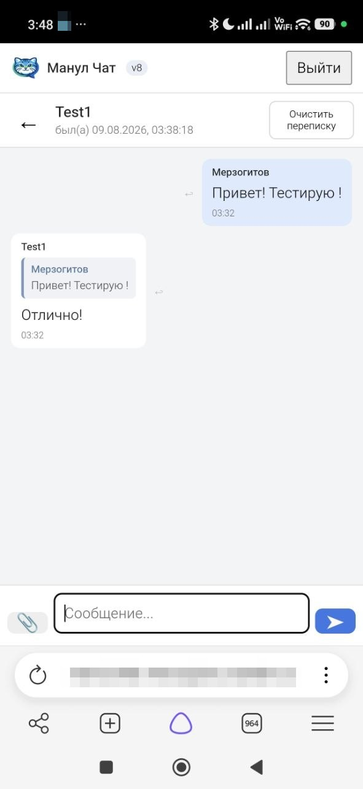

# 🐱 Манул Чат

Простой приватный веб-мессенджер на Python / FastAPI.

  

## Скриншоты

📷 Показать скриншоты

 

### Авторизация

  

### Чат на компьютере

  

  

### Чат на телефоне

  

Запуск:

1. Установить Python.
2. Открыть командную строку в этой папке.
3. Выполнить:

   python -m pip install -r requirements.txt

4. Запустить:

   python app.py

5. Открыть:

   http://127.0.0.1:8000

Для доступа с телефона в локальной сети:
   http://IP_КОМПЬЮТЕРА:8000

Первый администратор при новой базе:
При первом запуске новой базы программа создаст admin
и покажет случайный пароль в консоли.

СУЩЕСТВУЮЩАЯ БАЗА
Если в messenger.db уже есть admin, его пароль НЕ меняется.

Если у вас уже есть messenger.db от предыдущей версии:
- можно скопировать старый файл data\messenger.db в новую папку data\
- пользователи и сообщения сохранятся;
- новая таблица attachments создастся автоматически.

Изображения:
- JPG
- PNG
- WebP
- GIF
- до 20 МБ

Изображения сохраняются в:
   data\uploads\

Важно:
для публикации в Интернет используйте HTTPS через reverse proxy.

Очистка переписки:
- кнопка "Очистить переписку" скрывает всю текущую историю только у нажавшего пользователя;
- у второго участника история остаётся;
- администратор продолжает видеть всю переписку;
- сообщения и изображения физически из базы/архива не удаляются;
- новые сообщения после очистки снова отображаются;
- существующая messenger.db обновится автоматически (добавится таблица chat_clears).

Ответы на сообщения:
- возле сообщения есть кнопка ↩ "Ответить";
- выбранное сообщение показывается над полем ввода;
- можно отвечать и на текст, и на изображение;
- если исходное сообщение было скрыто пользователем через "Очистить переписку",
  цитата этого старого сообщения у него больше не показывается;
- сам новый ответ при этом остаётся виден как обычное сообщение;
- у второго пользователя цитата остаётся, если он свою переписку не очищал;
- администратор видит полную историю и все связи ответов;
- существующая messenger.db обновляется автоматически: добавляется поле reply_to_message_id.

На ПК возле КАЖДОГО сообщения постоянно видна кнопка:
    ↩ Ответить

На телефоне возле каждого сообщения видна круглая кнопка ↩.

Существующую базу data\messenger.db и папку data\uploads
можно перенести из предыдущей версии.

============================================================
 STAGE 1
============================================================

Эта сборка не меняет логику чата и интерфейс.

Что добавлено:
- случайный пароль первого администратора;
- development / production режимы;
- Secure cookie в production;
- кеширование статики в production;
- versioned URL для CSS и логотипов;
- SQLite WAL;
- busy_timeout 10 секунд;
- foreign_keys;
- удаление просроченных сессий.

НОВАЯ БАЗА
При первом запуске новой базы программа создаст admin
и покажет случайный пароль в консоли.

СУЩЕСТВУЮЩАЯ БАЗА
Если в messenger.db уже есть admin, его пароль НЕ меняется.

DEVELOPMENT
Windows:
    run_development.bat

или:
    set APP_ENV=development
    python app.py

В этом режиме можно работать по обычному HTTP.

PRODUCTION
Windows:
    run_production.bat

или:
    set APP_ENV=production
    python app.py

В production session cookie имеет флаг Secure.
Поэтому использовать нужно HTTPS через reverse proxy.

Кеширование в production:
- HTML: no-cache / перепроверка у сервера;
- API и защищённые вложения: no-store;
- CSS и другая статика: 7 дней;
- логотипы/favicon: 30 дней.

Рекомендуемая схема:
    Интернет
       |
      HTTPS :443
       |
    Reverse Proxy
       |
    http://127.0.0.1:8000
       |
    Манул Чат

Порт 8000 напрямую в Интернет не публиковать.

Следующий этап:
- CSRF;
- WebSocket Origin check;
- закрытие активного WebSocket при блокировке пользователя.
